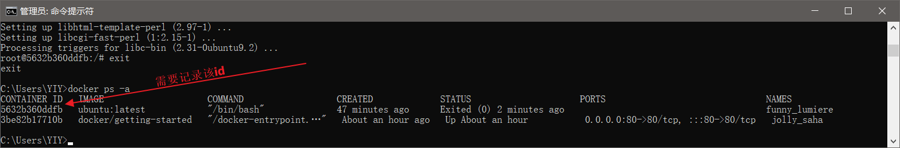
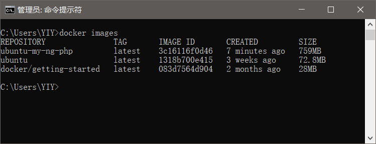
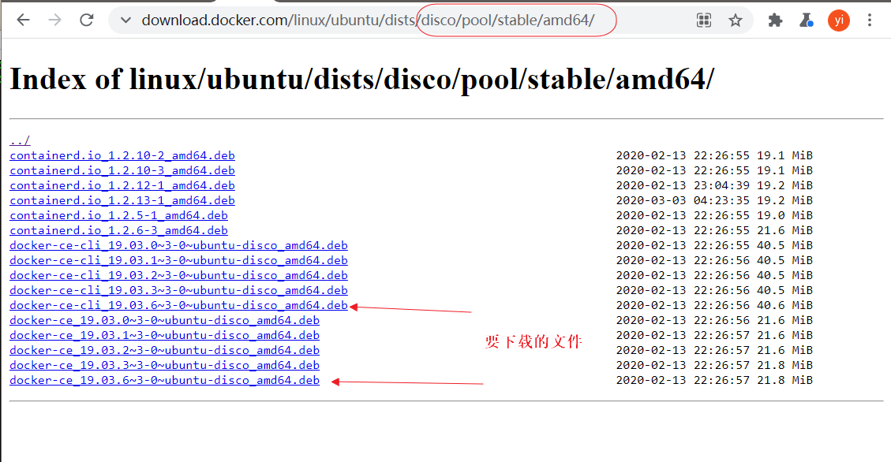
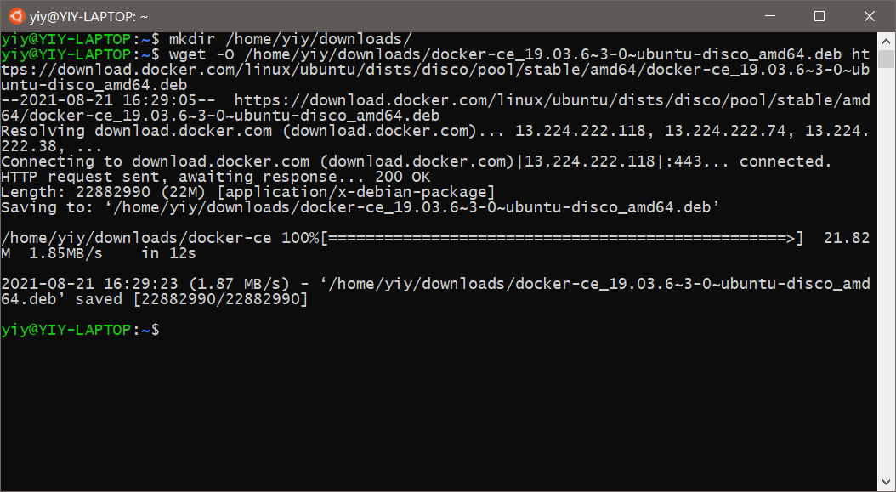

docker入门
==============================
## windows上安装docker ##

### 启动与安装WSL ###
参见《Windows Subsystem for Linux(WSL)的安装与管理》

### 下载安装docker desktop ###
https://docs.docker.com/desktop/windows/install/


## linux(centos)上安装docker
1. 升级yum
```shell
sudo yum update
```

> 该部分cleanup后要停顿很久才会进入verifying

2. 清除docker的旧版本
```shell
sudo yum remove docker \
                  docker-client \
                  docker-client-latest \
                  docker-common \
                  docker-latest \
                  docker-latest-logrotate \
                  docker-logrotate \
                  docker-engine
```

3. 安装yum的配置管理器
```shell
sudo yum install -y yum-utils
```

4. yum配置docker的仓库地址
```shell
sudo yum-config-manager --add-repo https://download.docker.com/linux/centos/docker-ce.repo
```
有些时候使用官网地址下载会非常慢，可以改用阿里云的镜像
```shell
yum-config-manager --add-repo http://mirrors.aliyun.com/docker-ce/linux/centos/docker-ce.repo
```

5. 安装docker引擎、容器服务与客户端
```shell
sudo yum install docker-ce docker-ce-cli containerd.io
```
> 如果出现"Delta RPMs disabled because /usr/bin/applydeltarpm not installed"错误，执行命令
```shell
yum provides '*/applydeltarpm'
yum install deltarpm
```
6. 启动docker服务
```shell
sudo systemctl start docker
```

## 启动 docker容器 ##
```
docker run -d -p 80:80 docker/getting-started
```
-d: 后台运行
-p: 端口映射 对宿主的80端口的访问映射到docker内系统的80端口
docker/getting-start: docker运行的映像，可以理解成一张带虚拟写功能的光盘。


用浏览器访问,测试是否成功


## 交互式制作镜像(其命令linux/windows通用) ##
1. 使用一个基础镜像做基础
在宿主命令行输入以下命令
```cmd
docker run -it ubuntu:latest /bin/bash
```
2. 安装服务器软件
进入容器终端后，安装服务器端软件
最后用exit退出容器终端
在容器终端linux命令行输入以下命令
```shell
apt-get install sudo
sudo apt-get install nginx-full
sudo apt-get install mysql-server
exit
```
3. 查看容器
在宿主命令行输入以下命令
```
docker ps -a
```

> -a参数表示所有的容器，包括已经停止运行的容器

4. 制作镜像
```
docker commit container-id image-name
```
> 这里的container-id就是上文图中的id
> image-name可以自己起名字

5. 查看镜像
在宿主命令行输入以下命令
```cmd
docker images
```


6. 查看运行容器
在宿主命令行输入
```cmd
docker ps -a
```


7. 停止已有的容器(让出80端口)
在宿主命令行输入以下命令,container-id就是上文图中标注的id
```cmd
docker stop [container-id或container-name]
```
8. 拷贝文件(一般是程序)到容器中
```
docker cp [host-filename]  [container-id]:[container-filename]
docker cp D:\learning\wechat-applet\docs\docker 9f72f243e03d:/
```

9.  以自己制作的镜像启动容器

```
docker run -itd -p 80:80 -p 3306:3306 ubuntu-my-ng-php nginx -g "daemon off;"
```
> 用2个-p参数暴露多个端口
> 用-t参数开启一个伪tty,维持1号进程,否则容器会自动停止
> nginx参数:指定启动ngnix

10. 删除
```
docker rm container-id
docker rmi image-id
```

## ubuntu上安装docker ##
### 移除过去安装的docker ###
```shell
sudo apt-get remove docker docker-engine docker.io containerd runc
```
### 使用程序包安装 ###
#### 浏览官方程序库，找到docker程序包文件的地址 ####
访问 https://download.docker.com/linux/ubuntu/dists 找到适合本机的程序包

引擎程序包: <https://download.docker.com/linux/ubuntu/dists/disco/pool/stable/amd64/containerd.io_1.2.6-3_amd64.deb>
引擎程序包: <https://download.docker.com/linux/ubuntu/dists/disco/pool/stable/amd64/docker-ce_19.03.6~3-0~ubuntu-disco_amd64.deb>
客户端程序包: <https://download.docker.com/linux/ubuntu/dists/disco/pool/stable/amd64/docker-ce-cli_19.03.6~3-0~ubuntu-disco_amd64.deb>

#### 进入linux ,下载程序包 ####
+ 创建下载目录。
该操作是为了让下载的文件归集在一个目录里
```shell
mkdir /home/yiy/downloads
```
+ 用wget命令下载文件
```shell
wget -O /home/yiy/downloads/containerd.io_1.2.6-3_amd64.deb https://download.docker.com/linux/ubuntu/dists/disco/pool/stable/amd64/containerd.io_1.2.6-3_amd64.deb

wget -O /home/yiy/downloads/docker-ce-cli_19.03.6~3-0~ubuntu-disco_amd64.deb https://download.docker.com/linux/ubuntu/dists/disco/pool/stable/amd64/docker-ce-cli_19.03.6~3-0~ubuntu-disco_amd64.deb

wget -O /home/yiy/downloads/docker-ce_19.03.6~3-0~ubuntu-disco_amd64.deb https://download.docker.com/linux/ubuntu/dists/disco/pool/stable/amd64/docker-ce_19.03.6~3-0~ubuntu-disco_amd64.deb
```


+ 用ubuntu的包管理命令安装程序包
```shell
sudo dpkg -i /home/yiy/downloads/containerd.io_1.2.6-3_amd64.deb

sudo dpkg -i /home/yiy/downloads/docker-ce-cli_19.03.6~3-0~ubuntu-disco_amd64.deb

sudo dpkg -i /home/yiy/downloads/docker-ce_19.03.6~3-0~ubuntu-disco_amd64.deb
```


[^1] [docker官网](https://www.docker.com/)
[^2] [docker官方文档](https://docs.docker.com/)
