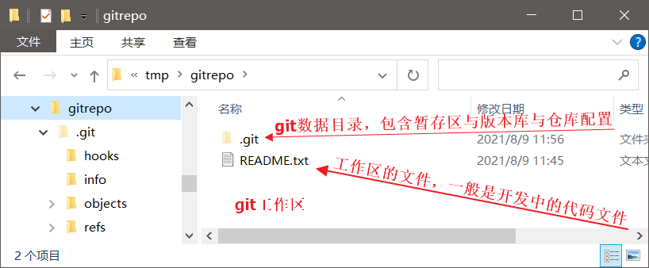

# git仓库 #
在某个目录中运行git init(git clone同理)，该目录即成为**git本地仓库**
git本地仓库有以下的目录结构

## 工作目录 working directory
有时候也叫做工作区，用来编辑保存项目文件与目录的地方，也是用户能直接操作的目录。
_工作目录即运行git init的目录_
## 缓存区 Stage space
保存了下次将提交的文件列表信息
一般在 Git 仓库目录中，是一个叫index的文件
通常多数说法还是叫暂存区或stage/Index
## 版本库
