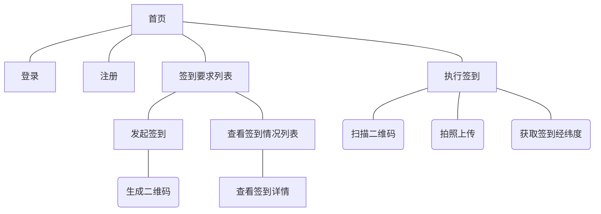

本文档主体上参考了文章《Markdown 语法手册完整整理》[^1]

# 转义 #
markdown 使用符号来标记文档。当我们在正文中想使用markdown中有语法含义的符号时，可以使用\来转义字符
比如#*+-等符号为markdown中最常用的语法标记，如果在正文中我们想将这些符号作为普通字符使用我们可以使用如下方式:
```
\# 在#前添加\，就不再作为标题处理
123\. 在数字后面的英文句号前添加\ ，该行将不会作为有序列表来解析
```
# 标题 #
在Markdown中，通过标题来组织文档大纲目录
Markdown 支持两种标题的语法，类 Setext 和类 atx 形式。

## Setext形式 ##
该形式是用底线的形式，利用 = （最高阶标题）和 - （第二阶标题），如:
```
这是一个一级标题
========
这是一个二级标题
-----------------------------------------
```

> + *任何数量的 = 和 - 都可以有效果，最好三个及以上，比较直观*

## Atx 形式 ##
  该形式则是在行首插入 1 到 6 个 # ，对应到标题 1 到 6 阶,如:
```
# 一级标题
## 二级标题
### 三级标题
#### 四级标题
##### 五级标题
###### 六级标题
```	
> + _\#后面需要后加一个空格_
> + _你可以选择性地「闭合」类 atx 样式的标题，这纯粹只是美观用的，若是觉得这样看起来比较舒适，你就可以在行尾加上 #，而行尾的 # 数量也不用和开头一样（行首的井字符数量决定标题的阶数）_

# 文本式样 #
可通过如下符号包含文本，将文本变为特定式样:

+ *\*斜体\*或\_斜体\_表示追加说明*
+ **\*\*粗体表示强调\*\***
+ ~~\~\~删除线\~\~(波浪号包含)~~
+ ***\*\*\*加粗斜体\*\*\****

> + _星号，下划线在markdown里有多重含义，\*还代表了列表等。要严格按照上述列子的写法，符号与符号之间，符号与文本之间不能有空白字符_

# 代码 #
## 行内式 ##
用`引起来的会被当做代码，如:
```
c语言中使用`printf(...)`函数来输出
```
效果如下:
c语言中使用`printf(...)`函数来输出

## 标记式 ##
前后用三个`括起来的的部分,会被当做代码处理，如
	\```javascript
	function fn(){
    console.log('hello')
    return 'ok'
  }
  alert(ok)
	\```
使用标记式时，可以在\```后面标注语言，md解析器会高亮该语言的语法，上例的显示效果如下
```javascript
function fn(){
  console.log('hello')
  return 'ok'
}
alert(ok)
```

## 缩进式 ##
缩进 4 个空格或是 1 个制表符的行会被当做代码
一个代码区块会一直持续到没有缩进的那一行（或是文件结尾）。

# 列表 #
列表包含无序列表与有序列表

## 无序列表 ##
使用 *，+，-后面跟一个空白符， 表示无序列表，如:
- \- 无序列表项 一
* \* 无序列表项 二
+ \+ 无序列表项 三

> + _符号后面的空白符是必须的。如果没有空白符，Markdown将会理解成粗体或斜体的语法_
> + _\-\*\+在列表中都表达列表项，没有区别

## 有序列表 ##
有序列表则使用数字接着一个英文句点
  1. 1\. 有序列表项 一
  2. 2\. 有序列表项 二
  1. 1\.有序列表项 三(注意该行书写的序号，并没有写3)

> + _符号后面的空白符是必须的。如果没有空白符，Markdown将会理解成粗体或斜体的语法_
> + 数字不必连续编号

# 超链接 #
有3种方式可以在文档中加入超链接

## 自动链接 ##
Markdown 支持以比较简短的自动链接形式来处理网址和电子邮件信箱，只要是用<>包起来， Markdown 就会自动把它转成链接。也可以直接写，也是可以显示成链接形式的
**语法代码**:
```
代码:
http://flowchart.js.org/
或:
<http://flowchart.js.org>
```
**效果**
http://flowchart.js.org/
或:
<http://flowchart.js.org>

## 行内式 ##
适用于要将超链接显示为链接文本，而不是不好阅读与理解的链接本身
**语法代码**
```
语法:[链接文本](超链接地址 "链接标题")
代码:[Markdown 语法手册完整整理](https://www.jianshu.com/p/8c1b2b39deb0 "title文本")
```
**效果**
[Markdown 语法手册完整整理](https://www.jianshu.com/p/8c1b2b39deb0 "title文本")


# 图片 #
图片本质上也是一种链接，故其语法与超链接的语法基本一致。只是在[]前面加了!符号表示该链接显示为图片。
有行内式与参考式2种语法
## 行内式 ## 
适用于在文档中只使用一次的图片
**语法代码**
```
语法: 
代码: 
```
**效果**


## 引用式 ##
适用于要在文档中反复使用的图片
**语法代码**
```
语法:
![图片Alt][标记]
[标记]:图片地址 "图片标题"
代码:
![markdown的图标][md-icon]
....
[md-icon]:md-file.png
```
**效果**
![markdown的图标][md-icon]

[md-icon]:md-file.png "md文档"

> + _图片跟标记之间必须有1个以上的换行或其他的md语法结构_

# 引用 # 
用> 开始行行会被处理成引用。
引用可以嵌套，用多个>来表示引用的级数
引用里面可以使用其他的md符号
如:
> \>开始的行表示引用
>> \>\> 用2个>>来嵌套引用
> 1. 1\. 引用里面嵌套了列表语法
> 1. 1\. 引用会连成块

# 表格 #
语法如下:
```
学号|姓名|分数
-|-|-
小明|男|75
小红|女|79
小陆|男|92
```
显示效果:
学号|姓名|分数
-|-|-
小明|男|75
小红|女|79
小陆|男|92

# 流程图 #
示例代码:
  \```flow
  st=>start: 开始
  io=>inputoutput: 验证
  op=>operation: 选项
  cond=>condition: 是 或 否？
  sub=>subroutine: 子程序
  e=>end: 结束

  st->io->op->cond
  cond(yes)->e
  cond(no)->sub->io
  \```

效果
```flow
st=>start: 开始
io=>inputoutput: 验证
op=>operation: 选项
cond=>condition: 是 或 否？
sub=>subroutine: 子程序
e=>end: 结束

st->io->op->cond
cond(yes)->e
cond(no)->sub->io
```
> 参见:flowchart.js流程图语法[^2]

# 时序图 #
示例代码:
  \```sequence
  participant 客户端 as A
  participant 服务端 as B
  participant 通行证中心 as C
  Note over A:用户输入通行证账号、密码
  A->C: 发送账号、密码
  Note over C:验证账号、密码
  C-->>A:返回token
  A->B:发送token
  B->C:验证token
  C-->>B:验证成功
  B-->>A:登陆成功
  Note left of A:左边注释
  B->B:自交互
  Note right of C:右边注释
  \```
效果：
```sequence
participant 客户端 as A
participant 服务端 as B
participant 通行证中心 as C
Note over A:用户输入通行证账号、密码
A->C: 发送账号、密码
Note over C:验证账号、密码
C-->>A:返回token
A->B:发送token
B->C:验证token
C-->>B:验证成功
B-->>A:登陆成功
Note left of A:左边注释
B->B:自交互
Note right of C:右边注释
```
> 参见:flowchart.js流程图语法[^2]

# 树或图
\```mermaid
graph TD
	首页---登录
	首页---注册
	首页---签到要求列表
	签到要求列表---发起签到
	发起签到---生成二维码(生成二维码)
	签到要求列表---查看签到情况列表
	查看签到情况列表---查看签到详情
	首页---执行签到
	执行签到---扫描二维码(扫描二维码)
	执行签到---拍照上传(拍照上传)
	执行签到---获取签到经纬度(获取签到经纬度)
\```
**效果**


# 参考文献 #
[^1]:[Markdown 语法手册完整整理](https://www.jianshu.com/p/8c1b2b39deb0)
[^2]:[flowchart.js官方网站](http://flowchart.js.org/)

