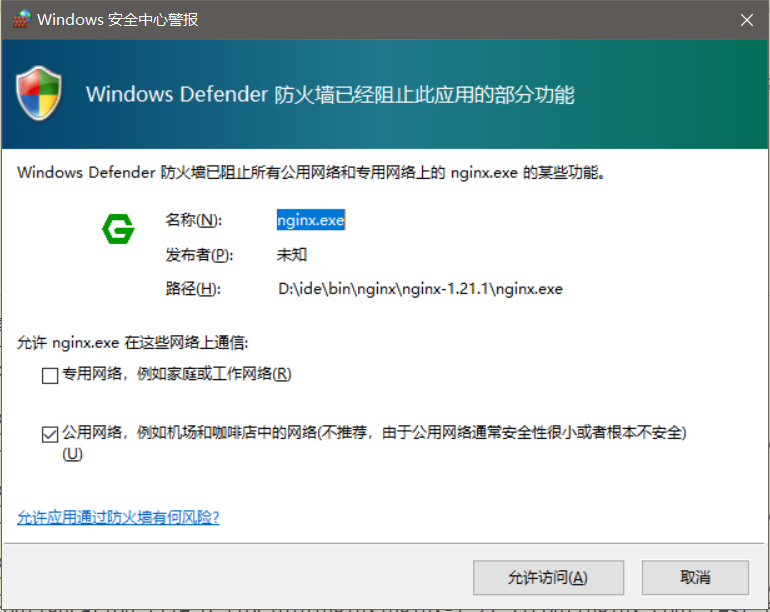
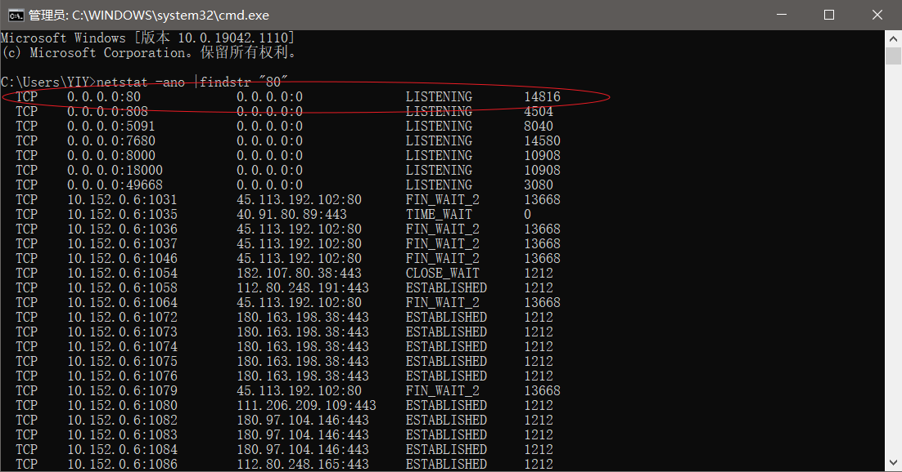
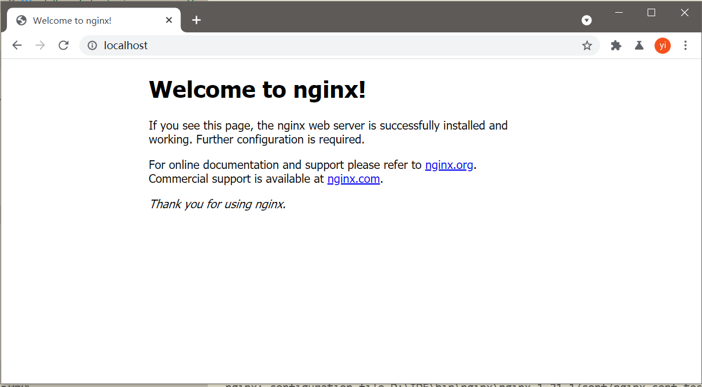

# windows平台的下载与启动 #
## 下载与展开 ##
+ 官网地址: http://nginx.org/en/download.html
+ 下载后得到: D:\IDE\dist\nginx-1.21.1.zip
+ 解压到指定目录: D:\IDE\bin\nginx\nginx-1.21.1
+ 得到如下的目录与文件:


## 检查配置 ##
跳转到nginx所在目录 ： `cd D:\IDE\bin\nginx\nginx-1.21.1\`
可以使用 `nginx -t -c /etc/nginx/nginx.conf`  这个检测配置是否正常
可能会出现如下的用户访问控制对话框，同意nginx使用网络


## 端口检查 ##
+ 查看端口占用: 用WIN+R打开CMD，执行`netstat -ano |findstr "80"`

+ 查看进程: 查看到对应的进程id之后，就可以通过id查找对应的进程名称，使用命令`tasklist |findstr "进程id号"`
+ 杀进程: 在命令框中输入如下命令`taskkill /f /t /im "进程id或者进程名称"`
本小结参考了《windows系统如何查看端口被占用、杀进程》[^1]

## 启动 ##
+ 跳转到nginx所在目录 ： `cd D:\IDE\bin\nginx\nginx-1.21.1\`
+ 执行命令 `nginx.exe`
+ 打开浏览器，访问"http://localhost"
+ 显示nginx的欢迎页


## 用指定配置文件启动 ##

```
nginx -c /usr/local/nginx/conf/nginx.conf
```

> ***如果不指定配置配置文件启动，配置文件默认为当前所在目录的conf/nginx.conf***
> ***默认的nginx配置指定的是80端口，要先检查80端口是否被占用***

[^1] [windows系统如何查看端口被占用、杀进程](https://jingyan.baidu.com/article/fdffd1f89a0c8af3e98ca10e.html)
