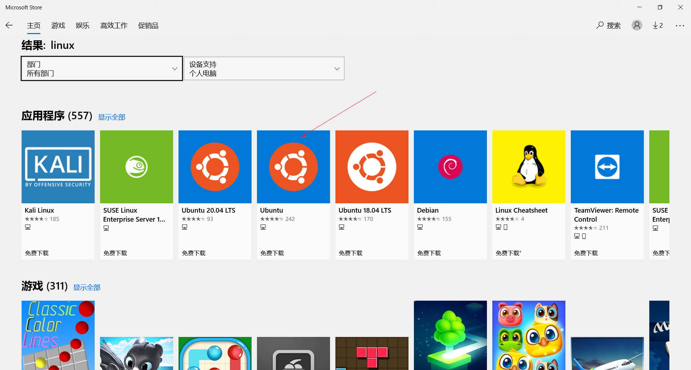

Windows Subsystem for Linux(WSL)的安装、管理与使用
============================
windows自带一个子系统Windows Subsystem for Linux(WSL)
本部分参考了文章[^1][^2][^3]

## 启动hyper-v ##
尝试一下powershell命令
```powershell
Enable-WindowsOptionalFeature -Online -FeatureName Microsoft-Hyper-V -All

DISM /Online /Enable-Feature /All /FeatureName:Microsoft-Hyper-V
```
如果都出错，
将下面的代码拷贝到hyperv.bat文件中，
以管理员身份运行该脚本
```cmd
pushd "%~dp0"

dir /b %SystemRoot%\servicing\Packages\*Hyper-V*.mum >hyper-v.txt

for /f %%i in ('findstr /i . hyper-v.txt 2^>nul') do dism /online /norestart /add-package:"%SystemRoot%\servicing\Packages\%%i"

del hyper-v.txt

Dism /online /enable-feature /featurename:Microsoft-Hyper-V-All /LimitAccess /ALL
```


## 打开系统的WSL功能 ##
1. powershell方式
  以**管理员身份**运行powershell
	WIN+S打开系统搜索栏，以管理员身份打开powershell运行
	
  
	运行代码
	```powershell
   Enable-WindowsOptionalFeature -Online -FeatureName Microsoft-Windows-Subsystem-Linux
	 ```
	
2. 图形界面方式
  控制面板(WIN+R 搜索"控制面板")->程序和功能->启用或关闭Windows功能->勾选 适用于Linux的Windows子系统
  
  
	 
## 升级wsl2 ##
下载wsl2安装程序
https://wslstorestorage.blob.core.windows.net/wslblob/wsl_update_x64.msi
安装后重启

```
wsl --set-default-version 2
```
执行该命令后重启

## 从微软商城中安装linux ##
1. 打开微软商城
  在搜索框中填入"microsoft store"或"微软商城"
  

2. 在微软商城中搜索linux

3. 选择一个linux发行版本安装

4. 安装完成后在本机系统中找到linux子系统
   WIN+S 录入ubuntu
	 
5. 点击图标进入linux的终端


## 管理(wslconfig命令) ##
1. 查看已安装的wsl
version 1
```cmd
wslconfig /list
```
version 2
```cmd
wsl --list
```


2. 设置默认的WSL
```cmd
wslconfig /setdefault <DistributionName>
```
执行bash命令时将进入该指定的WSL

3. 卸载指定的WSL
```
wslconfig /unregister <DistributionName>
```
当系统出现问题，我们可以卸载后重新安装

## WSL与宿主的文件互操作 ##
+ 从linux访问windows文件
windows的磁盘都自动挂载在/mnt目录下，直接访问/mnt/d即可访问windows下的d盘


+ 从windows访问linux文件
微软***强烈不建议**在外部对WSL文件系统进行更改。一般用于读取。
C:\Users\YIY\AppData\Local\Packages\CanonicalGroupLimited.UbuntuonWindows_79rhkp1fndgsc\LocalState\rootfs


[^1]: [Windows Subsystem for Linux Installation Guide for Windows 10](https://docs.microsoft.com/en-us/windows/wsl/install-win10)
[^2]: [玩转 Windows 自带的 Linux 子系统](https://zhuanlan.zhihu.com/p/258563812)
[^3]: [WSL(Windows Subsystem for Linux)的安装与使用](https://www.cnblogs.com/JettTang/p/8186315.html)